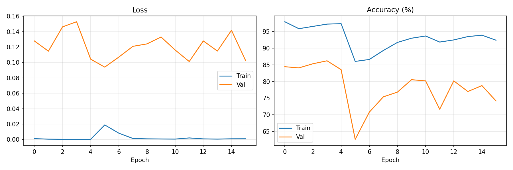
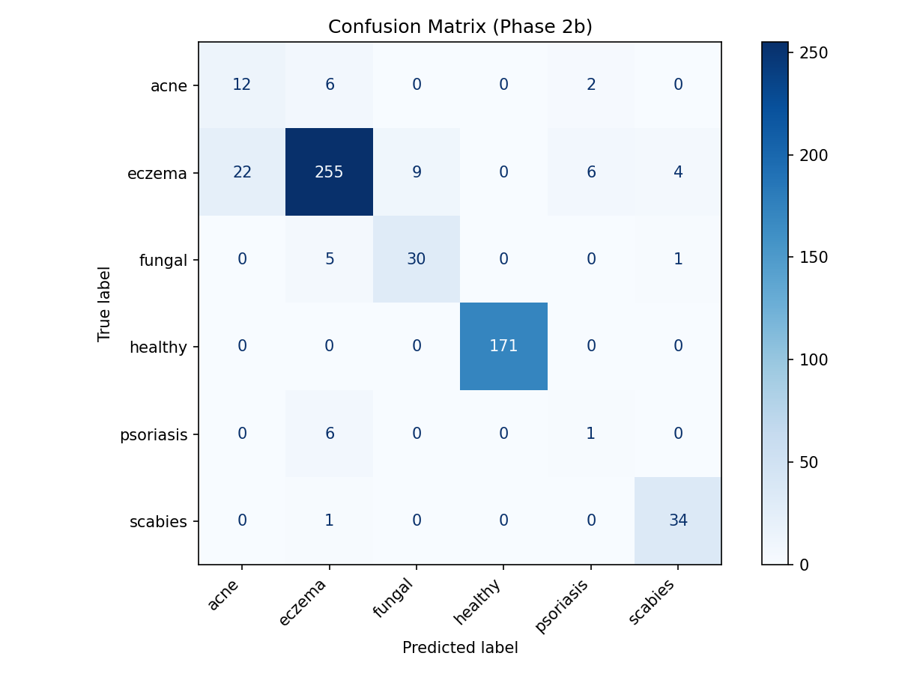
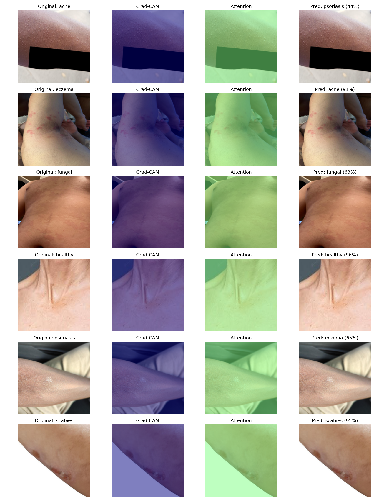

# SkinScan

A skin disease classification platform with deep learning, model attention visualization, and AI-powered explanations. Built with DINOv2, FastAPI, and React.

## Overview

This project provides:

- REST API for skin disease classification with model attention visualization
- AI-generated explanations using Claude vision API
- **Analyze Mode**: Upload or photograph skin areas for AI-powered analysis with visual + written explanations
- Single-model architecture optimized for skin disease detection

## Model

| Model          | Task                        | Classes                                                     | Accuracy |
| -------------- | --------------------------- | ----------------------------------------------------------- | -------- |
| `skin_disease` | Skin Disease Classification | Acne, Eczema, Fungal Infection, Healthy, Psoriasis, Scabies | 89%      |

## Results

> Click below to view training curves, confusion matrix, and model attention visualizations.

<details>
<summary><strong>Skin Disease Classification</strong> (89% accuracy)</summary>

### Skin Disease Classification

6-class classification of skin images using DINOv2 ViT-B/14.

| Metric        | Value                                                       |
| ------------- | ----------------------------------------------------------- |
| Test Accuracy | 89%                                                         |
| Classes       | Acne, Eczema, Fungal Infection, Healthy, Psoriasis, Scabies |
| Architecture  | DINOv2 ViT-B/14 (partially fine-tuned)                      |

**Training Progress**



**Confusion Matrix**



**Model Attention Visualizations**



</details>

## Project Structure

```
skin-disease-app/
├── api/
│   ├── app/
│   │   ├── main.py             # FastAPI application
│   │   ├── models/
│   │   │   ├── base.py         # Base classifier interface
│   │   │   └── skin_disease.py # Skin disease classifier (DINOv2)
│   │   └── utils/
│   │       ├── gradcam.py      # Model attention visualization
│   │       └── llm.py          # Claude LLM integration
│   ├── scripts/
│   │   ├── generate_explanations.py  # Batch generate explanations
│   │   └── generate_overlays.py      # Batch generate overlays
│   ├── weights/                # Model weights (not tracked in git)
│   ├── Dockerfile
│   ├── fly.toml
│   └── requirements.txt
├── frontend/
│   ├── src/
│   │   ├── pages/              # HomePage, AnalyzePage
│   │   ├── components/         # React components
│   │   ├── hooks/              # Custom hooks
│   │   └── utils/              # API, sample data
│   ├── public/
│   │   └── samples/            # Sample images and pre-cached overlays
│   ├── package.json
│   └── vite.config.js
├── notebook/
│   └── skin_disease_classifier_v3.ipynb  # Training notebook (data pipeline + model training)
└── assets/                     # README images
```

## Technical Details

### Model Architecture

DINOv2 ViT-B/14 pre-trained on skin diseases ([Jayanth2002/dinov2-base-finetuned-SkinDisease](https://huggingface.co/Jayanth2002/dinov2-base-finetuned-SkinDisease)) with a linear classifier head:

- Input: 224x224 RGB images
- Backbone: DINOv2 ViT-B/14 (partially fine-tuned — last 4 encoder layers)
- Classifier: Dropout(0.3) → Linear(768, 6)
- Training: Two-phase — frozen backbone pre-training, then partial unfreeze with EMA + MixUp

### Model Attention Visualization

Extracts CLS-to-patch self-attention weights from DINOv2's last encoder layer, averages across attention heads, and reshapes to a spatial grid for heatmap visualization. This shows which image regions the model focuses on when making its prediction.

### LLM Explanations

Image-specific explanations generated using Claude Haiku vision API, describing anatomical findings and model attention focus areas.

### Datasets

| Dataset      | Source                                                                                      | Description                             |
| ------------ | ------------------------------------------------------------------------------------------- | --------------------------------------- |
| SCIN         | [Google HuggingFace](https://huggingface.co/datasets/google/scin)                           | 5,033 user-submitted phone photos       |
| SkinDisNet   | [Mendeley](https://data.mendeley.com/datasets/97s3xnrk6g)                                   | 1,710 smartphone photos from Bangladesh |
| Skin Lesions | [HuggingFace](https://huggingface.co/datasets/ahmed-ai/skin-lesions-classification-dataset) | Healthy skin images                     |
| DermNet      | [Kaggle](https://www.kaggle.com/datasets/shubhamgoel27/dermnet)                             | Clinical atlas photos                   |
| SD-198       | [HuggingFace](https://huggingface.co/datasets/Ammar-Dar/sd-198)                             | Fine-grained clinical images            |

## API Reference

### Endpoints

| Method | Endpoint                        | Description                          |
| ------ | ------------------------------- | ------------------------------------ |
| `GET`  | `/health`                       | Health check                         |
| `GET`  | `/models`                       | List available models                |
| `POST` | `/predict/{model_name}`         | Classification                       |
| `POST` | `/predict/{model_name}/gradcam` | Classification with attention map    |
| `POST` | `/explain/{model_name}`         | AI-generated explanation             |

## Deployment

### Frontend (Vercel)

Hosted on Vercel with automatic deploys on push to `master`.

- **URL**: https://skinscan-two.vercel.app
- SPA routing is configured via `frontend/vercel.json`

### API (Fly.io)

Hosted on Fly.io with suspend mode for fast resume (~3s) instead of cold starts (~20s).

```bash
cd api
fly deploy --ha=false
```

**For demos** (keep machine always warm, no suspend delay):

```bash
fly scale count 1 --app skinscan-api
```

**Reset to auto-suspend after demo:**

```bash
fly scale count 0 --app skinscan-api
```

**View logs:**

```bash
fly logs -a skinscan-api
```

## Local Development

### API

```bash
cd api
python3 -m venv venv
source venv/bin/activate
pip install -r requirements.txt

# Add weights to weights/
# Add ANTHROPIC_API_KEY to .env

python -m uvicorn app.main:app --reload --port 8000
```

API docs: http://localhost:8000/docs

### Frontend

```bash
cd frontend
npm install

# Create .env.local for local development
echo "VITE_API_URL=http://localhost:8000" > .env.local

npm run dev
```

Frontend: http://localhost:5173

## License

MIT

## Acknowledgments

- [SCIN Dataset](https://huggingface.co/datasets/google/scin) by Google
- [SkinDisNet Dataset](https://data.mendeley.com/datasets/97s3xnrk6g) by Mendeley
- [DINOv2](https://arxiv.org/abs/2304.07193) by Meta AI
